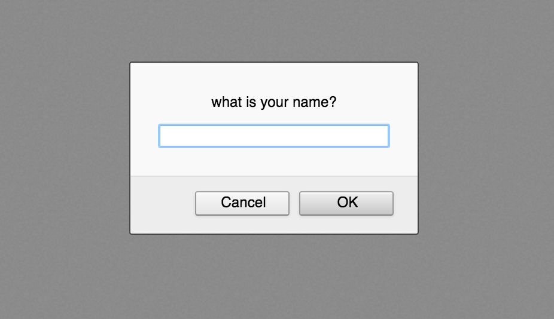
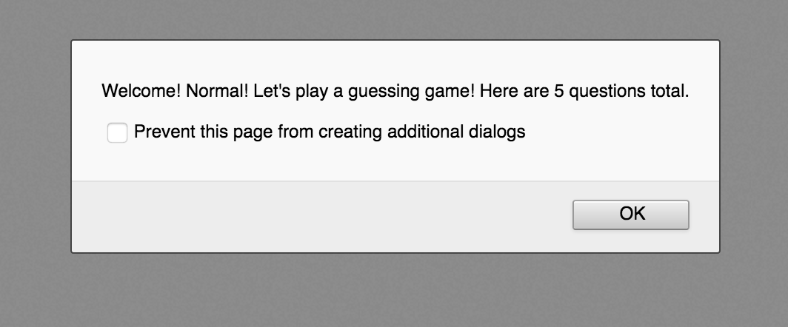
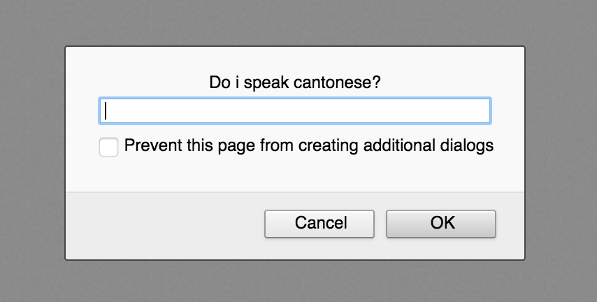
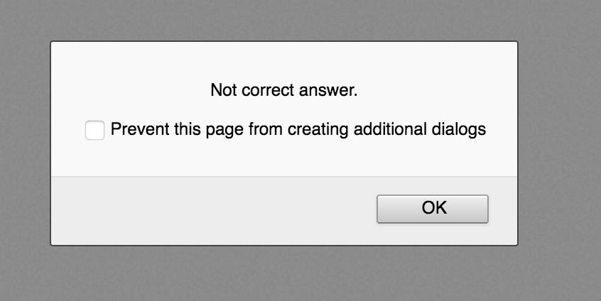
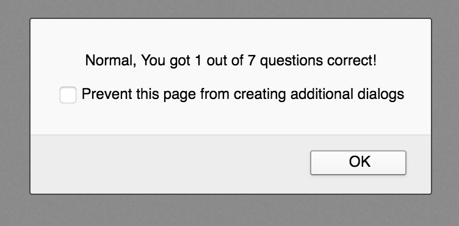
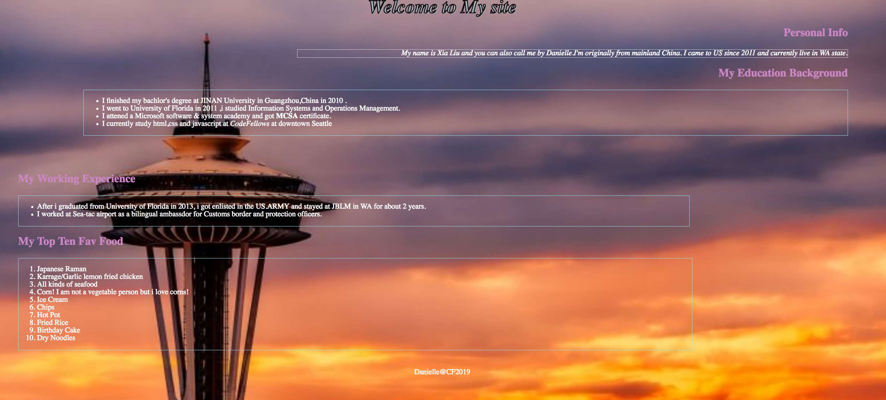

# 201d56-AboutMe

# A personal website to let users know about me

- when user first comes to the site will see a window to ask user's name

- After user type in there name, will show greeting

- Then start a small guessing game to help user know better about me, there are 7 questions total, here just show one example:

- If user answer the correct answer

- If user answer the wrong answer

- After all the questions, user will get a score

- In the end, user will see my page

